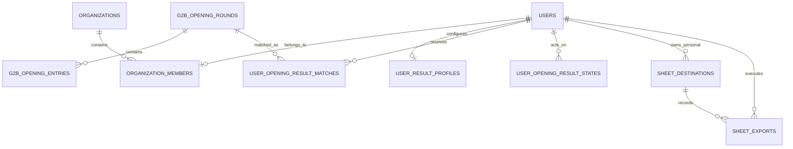

# iCore 개찰결과 데이터베이스 스키마

> 기준 소스: `icore-back/app/data/models.py`, `icore-back/app/g2b/opening_results/models.py`. 이 문서는 현재 SQLAlchemy 모델의 핵심 소유권·중복 방지·보존 의미를 요약한다.

## 1. 설계 원칙

1. 개찰결과 원본은 사용자별로 복제하지 않고 공통 테이블에 한 번 저장한다.
2. 사용자별 차이는 프로필, 매칭, 처리 상태와 개인 Sheet 목적지에만 저장한다.
3. 입찰공고 컨텍스트와 개찰결과는 공고번호·차수의 논리 키로 연결하며 외래키는 두지 않는다.
4. 숫자 PK는 내부 참조에 사용하고, 외부에서 같은 결과가 다시 와도 유지되는 `external_key`를 중복·재노출 방지 키로 사용한다.
5. 최근 14일은 조회·매칭 범위이며 물리 삭제 기간이 아니다.

## 2. 핵심 관계



`scraper_notices`와 `g2b_opening_rounds`는 `(bid_notice_no, bid_notice_ord)`로 논리 연결한다. DB 외래키가 아니므로 공고 컨텍스트가 없거나 같은 키가 중복되면 Sheet 반영 단계에서 오류로 처리한다.

## 3. 인증과 접근 범위

| 테이블 | 소유 모듈 | 핵심 컬럼·제약 | 의미 |
| --- | --- | --- | --- |
| `users` | 인증 | `username` UNIQUE, `email` UNIQUE, `google_sub` UNIQUE, `role`, `is_active` | Google 계정 연결과 앱 권한의 사용자 원장이다. |
| `organizations` | 인증/접근 범위 | `slug` UNIQUE, `is_active` | 현재 사용자 접근 범위를 묶는 컨테이너다. |
| `organization_members` | 인증/접근 범위 | UNIQUE(`organization_id`, `user_id`), `user_id` 자체도 UNIQUE | 한 사용자가 현재 최대 한 조직에 속하며 `admin`·`member` 역할을 가진다. |
| `user_result_profiles` | 개찰결과 매칭 | `user_id` UNIQUE, `enabled`, `keywords`, `excluded_keywords` | 사용자당 하나의 개인 키워드 프로필이다. `organization_id`는 인증 범위를 함께 보존한다. |
| `organization_result_profiles` | 개찰결과 매칭 | `organization_id` UNIQUE | 현재 코드에 남아 있는 조직 조건 프로필이다. 기본 사용자 화면은 개인 프로필을 사용한다. |

## 4. 입찰공고 컨텍스트와 공통 개찰 원본

| 테이블 | 소유 모듈 | 핵심 컬럼·제약 | 중복·생명주기 의미 |
| --- | --- | --- | --- |
| `scraper_notices` | 입찰공고 | `dedup_key` UNIQUE, `bid_notice_no`, `bid_notice_ord`, 공식 공고 필드 | 입찰공고 원본과 Sheet용 공식 컨텍스트다. 공고번호는 인덱스지만 단독 UNIQUE가 아니다. |
| `g2b_opening_rounds` | 개찰결과 | `external_key` UNIQUE, 공고번호·차수·분류번호·재입찰번호, 상태·낙찰 요약 | 사용자 ID가 없는 공통 개찰 회차다. 동일 회차 재수집은 insert가 아니라 update한다. |
| `g2b_opening_entries` | 개찰결과 | `round_id` FK, `external_key` UNIQUE, 순위·업체·가격점수·기술점수 | 공통 업체별 상세다. 라운드 삭제 시 CASCADE된다. |
| `g2b_result_snapshots` | 개찰결과 | UNIQUE(`entity_type`, `entity_key`, `payload_hash`), `raw_payload` | 같은 원문 버전의 중복 저장을 막고 서로 다른 응답 버전은 보존한다. |
| `g2b_opening_collection_runs` | 개찰결과 | `run_key` UNIQUE, 수집 구간, 상태, 건수, `claim_token` | KST 자정·정오의 12시간 슬롯 실행 이력이다. 동일 성공 슬롯을 다시 실행하지 않는다. |
| `g2b_opening_collection_leases` | 개찰결과 | `business_type` PK, `claim_token`, `claimed_at` | 같은 사업유형의 수동·정기 수집을 한 번에 하나로 제한한다. |

`g2b_opening_rounds.external_key`는 다음 값을 결합한다.

```text
business_type | bid_notice_no | bid_notice_ord | bid_class_no | rebid_no
```

공고 차수·분류·재입찰번호는 중복 비교 시 숫자형 0 채움을 정규화한다. 업체 `external_key`는 라운드 키와 사업자번호 또는 업체명으로 만든 안정 키의 해시다.

## 5. 사용자별 매칭과 재노출 방지

| 테이블 | 소유 모듈 | 핵심 컬럼·제약 | 의미 |
| --- | --- | --- | --- |
| `user_opening_result_matches` | 개찰결과 매칭 | UNIQUE(`user_id`, `result_external_key`), `round_id` FK, `matched_keywords`, `is_current_match` | 공통 원본을 사용자 받은 목록으로 연결한다. 조건에서 벗어나면 삭제하지 않고 현재 매칭 여부를 내린다. |
| `user_opening_result_states` | 개찰결과 UX | UNIQUE(`user_id`, `result_external_key`), `state`, `acted_at` | `DISMISSED`·`EXPORTED` tombstone이다. 공통 원본을 삭제하지 않고 사용자에게만 숨긴다. |
| `organization_opening_result_matches` | 개찰결과 매칭 | UNIQUE(`organization_id`, `result_external_key`) | 현재 코드에 남아 있는 조직 조건 매칭이다. 사용자 화면의 기본 조회는 사용자 매칭을 사용한다. |

사용자 상태가 숫자 `round_id`가 아니라 `result_external_key`를 저장하므로 공통 원본 행이 삭제 후 재생성되더라도 같은 결과의 재노출을 막을 수 있다. 사용자가 제외를 실행취소하면 본인의 `DISMISSED` 상태만 삭제한다. 성공한 `EXPORTED` 상태는 실행취소하지 않는다.

## 6. Google Sheet 목적지와 반영 이력

| 테이블 | 소유 모듈 | 핵심 컬럼·제약 | 의미 |
| --- | --- | --- | --- |
| `sheet_destinations` | 개찰결과 Sheet | UNIQUE(`spreadsheet_id`, `tab_name`), `owner_user_id`, `is_default`, `is_active`, 반영 lock | `owner_user_id`가 있으면 개인 Sheet, 없으면 조직 공용 Sheet다. 기본 제품 흐름은 개인 목적지다. 삭제 API는 행 삭제 대신 비활성화한다. |
| `sheet_exports` | 개찰결과 Sheet | UNIQUE(`destination_id`, `result_external_key`), `exported_by_user_id`, `status`, 시도·오류·성공 시각 | 목적지별 같은 결과의 중복 반영을 막는다. `PENDING`·`FAILED`·`SUCCEEDED` 상태로 외부 호출 결과를 추적한다. |

Sheet 반영은 다음 두 단계로 실행된다.

1. `dry_run=true`가 선택 결과와 목적지를 해시한 `preview_token`을 만든다. 이 단계는 DB의 반영 성공 상태나 Google Sheet를 변경하지 않는다.
2. 같은 토큰으로 `dry_run=false`를 요청하면 목적지 lock과 `sheet_exports` claim을 잡은 뒤 Google API를 호출한다. 성공 후 `SUCCEEDED`와 사용자 `EXPORTED` 상태를 함께 기록한다.

Google API 실패 시 export 이력은 `FAILED`가 되고 사용자 받은 목록은 유지되어 재시도할 수 있다. Sheet 자체는 공고번호 기준으로 기존 A:Q 행을 갱신하거나 새 행을 추가한다.

## 7. 입찰공고 수집 운영 테이블

| 테이블 | 의미 |
| --- | --- |
| `scraper_configs` | 입찰공고 수집 활성 여부, 실행 시각, 대상 Sheet·수신자, 포함·제외 키워드 설정 |
| `scraper_runs` | 입찰공고 워커 실행 결과와 수집·중복·메일·Sheet 건수 |
| `system_migrations` | 애플리케이션 시작 시 수행한 호환성 backfill의 적용 키 |

이 계열은 개찰결과 12시간 수집 실행 이력인 `g2b_opening_collection_runs`와 별개다.

## 8. 보존 정책의 현재 상태

| 데이터 | 현재 동작 |
| --- | --- |
| 사용자 목록·매칭 후보 | 기본 최근 14일만 조회하고 재매칭한다. |
| 수집 누락 보충 | 마지막 성공 이후를 보충하되 한 번에 최대 최근 14일까지다. |
| 공통 라운드·업체·스냅샷 | 14일 이후 자동 삭제하지 않는다. 명시적 TTL·정리 작업이 아직 없다. |
| 수집 실행 이력 | 자동 삭제하지 않는다. |
| `DISMISSED`·`EXPORTED` 상태 | 재노출 방지를 위해 유지한다. |
| `sheet_exports` | 중복 반영과 재시도를 판정하기 위해 유지한다. |
| Sheet 목적지 | 삭제 요청 시 `is_active=false`로 소프트 삭제한다. |

따라서 “14일”을 DB 유효기한으로 해석하면 안 된다. 물리 보존기간을 도입하려면 원본보다 먼저 `user_opening_result_states`, `sheet_exports`, 스냅샷의 장기 보존 요구를 분리하고 별도 정리 작업과 운영 지표를 설계해야 한다.
