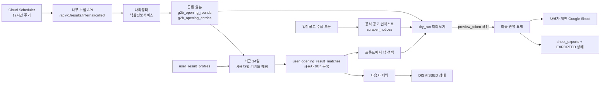

# iCore 개찰결과 시스템 아키텍처

> 기준: 2026-07-20 현재 실행 코드. 노코드 랜딩페이지 빌더·배포 기능은 현행 범위에 포함하지 않는다.

## 1. 현재 제품 범위

iCore의 중심 흐름은 **개찰결과 공통 원본 1개를 수집하고, 사용자별 키워드로 받은 목록을 만든 뒤, 사용자가 고른 결과만 개인 Google Sheet에 반영하는 것**이다.

- 나라장터 개찰결과는 사용자 수와 관계없이 한 번만 수집한다.
- 각 사용자는 본인의 포함·제외 키워드로 최근 14일 원본을 매칭한다.
- 목록 조회, 키워드 변경, 행 선택만으로는 Google Sheets를 호출하지 않는다.
- 사용자가 선택 결과의 서버 미리보기를 확인하고 최종 반영을 다시 요청해야 Sheet가 변경된다.
- Sheet의 공식 사업명·수요기관·기초금액 등은 입찰공고 모듈이 저장한 공고 컨텍스트를 사용한다.

## 2. 구성 요소

| 영역 | 현재 역할 | 주요 코드 |
| --- | --- | --- |
| Web | Google 로그인, 최근 14일 받은 목록, 키워드 설정, 상세 확인, 행 선택·미리보기·반영 | `icore-front/src/App.jsx`, `icore-front/src/pages/OpeningResultsPage.jsx` |
| FastAPI | 인증, 개찰결과 수집·조회, 사용자 매칭, Sheet 목적지·반영 API | `icore-back/main.py`, `icore-back/app/g2b/opening_results/router.py` |
| 개찰결과 도메인 | 12시간 수집 슬롯, 공통 원본·업체 순위 저장, 매칭, Sheet 행 생성 | `icore-back/app/g2b/opening_results/` |
| 입찰공고 도메인 | `scraper_notices`에 공식 공고 컨텍스트 저장 | `icore-back/app/g2b/bid_notices/`, `icore-back/cloudrun/g2b_worker/main.py` |
| DB | 공통 원본, 사용자 프로필·매칭·처리 상태, Sheet 목적지·이력 저장 | SQLAlchemy, `DATABASE_URL`로 연결 |
| 외부 서비스 | 나라장터 낙찰정보서비스, Google Identity Services, Google Sheets API, Cloud Scheduler | 서버 환경변수로 연결 |

## 3. 데이터 흐름



### 3.1 12시간 공통 수집

1. Cloud Scheduler가 KST 자정·정오 기준 12시간 슬롯의 내부 API를 호출한다.
2. 서버가 나라장터 개찰 목록, 업체별 순위·점수, 최종 낙찰정보를 조회한다.
3. `external_key`로 기존 라운드와 업체를 갱신하고 동일 결과의 중복 행 생성을 막는다.
4. 같은 슬롯은 `run_key`로 한 번만 성공 처리하고, 동시 수집은 lease와 `claim_token`으로 직렬화한다.
5. 저장 후 활성 사용자 프로필을 평가해 받은 목록을 갱신한다. 업체 상세는 사용자 중 한 명 이상에게 매칭된 결과를 공통으로 수집한다.

수집 API는 DB만 갱신하며 Google Sheet에 쓰지 않는다. 놓친 구간은 마지막 성공 시점부터 보충하되 최대 최근 14일까지만 조회한다.

### 3.2 사용자별 매칭과 받은 목록

- 포함 키워드는 OR 조건이다. 하나라도 제목에 매칭되면 후보가 된다.
- 제외 키워드는 포함 키워드보다 우선한다.
- 키워드 판정 대상은 사업 제목이며 기관명·업체명은 사용하지 않는다.
- 프로필 변경은 외부 API를 호출하지 않고 저장된 최근 14일 공통 원본을 즉시 재매칭한다.
- `DISMISSED` 또는 `EXPORTED` 상태인 결과는 같은 `external_key`로 다시 수집되어도 해당 사용자에게 재노출하지 않는다.

### 3.3 입찰공고 컨텍스트 연결

개찰결과와 입찰공고는 DB 외래키가 아니라 `(bid_notice_no, bid_notice_ord)` 논리 키로 연결한다. 입찰공고 모듈이 다음 공식값을 소유하고, 개찰결과 모듈은 Sheet 미리보기·반영 시 읽기만 한다.

- 사업명, 공식 수요기관명, 기초금액, 가격결정방법
- 제안마감, 지역제한, 2단계 입찰 여부

공식 컨텍스트가 없거나 필수값이 비어 있거나 같은 공고번호·차수의 공고가 여러 건이면 Google API 호출 전에 반영을 차단한다. 업체별 순위·점수 상세가 아직 수집되지 않은 결과도 반영할 수 없다.

### 3.4 선택 미리보기와 개인 Sheet 반영

1. 사용자가 본인의 받은 목록에서 최대 100건을 선택한다.
2. 프론트가 `dry_run=true`로 서버 미리보기를 요청한다.
3. 서버가 선택 ID, 개인 Sheet 목적지, 공식 공고 컨텍스트와 업체별 상위 5개 점수를 조합해 A:Q 17개 열을 반환한다.
4. 사용자가 확인하면 프론트가 같은 `preview_token`과 `dry_run=false`로 최종 요청한다.
5. 서버는 미리보기 이후 데이터·목적지가 바뀌지 않았는지 확인한 뒤 Google Sheets를 upsert한다.
6. 성공 이력을 `sheet_exports`에 남기고 해당 사용자 상태를 `EXPORTED`로 기록한다.

개인 목적지는 `sheet_destinations.owner_user_id`로 소유자를 구분한다. 서비스계정 자격증명은 백엔드에만 있고, 프론트에는 Sheet 공유에 필요한 서비스계정 이메일만 제공한다.

## 4. 인증·권한 경계

| 경계 | 현재 검증 |
| --- | --- |
| 사용자 로그인 | 백엔드가 Google ID 토큰의 서명, audience, issuer, `email_verified`, hosted domain을 검증한다. 허용 도메인은 기본 `iceu.kr`, `iceu.co.kr`이며 신규 계정은 승인 이메일 목록에도 있어야 한다. |
| 사용자 API | 서명된 Bearer 토큰과 활성 사용자·멤버십을 확인한다. 조회·키워드·제외·개인 Sheet는 `user_id`로 범위를 제한한다. |
| 수동 공통 수집 | 시스템 관리자만 `/api/v1/results/collect`를 호출할 수 있다. |
| 정기 공통 수집 | 운영 환경에서 내부 토큰과 Cloud Scheduler OIDC의 audience·서비스계정 이메일을 모두 검증한다. |
| Google Sheets | 개인 목적지는 소유자만 조회·검증·반영한다. 실제 Google 자격증명은 서버 환경에만 둔다. |
| 로컬 개발 | 단일 사용자 모드는 `local`·`test`의 loopback 요청에서만 허용한다. 운영에서는 비활성화한다. |

기존 조직 테이블과 조직 공용 Sheet 권한은 현재 코드에 남아 있지만, 제품의 기본 출력 흐름은 사용자 프로필과 개인 Sheet 목적지다.

## 5. 보존과 운영 경계

- **최근 14일**은 프론트 기본 조회, 사용자 매칭, 수집 누락 보충의 범위다.
- 14일이 지난 공통 원본·스냅샷·실행 이력을 자동 삭제하는 TTL 작업은 현재 구현되어 있지 않다.
- 사용자 제외 상태와 성공한 Sheet 반영 이력은 재노출·중복 반영 방지를 위해 유지한다.
- 12시간 실행 시각과 호출 재시도는 배포 환경의 Cloud Scheduler 설정이 필요하다. 애플리케이션은 슬롯 중복과 동시 실행을 방어한다.

## 6. 현행 런타임 API

```text
POST /api/auth/google
GET  /api/auth/me

POST /api/v1/results/collect
POST /api/v1/results/internal/collect
GET  /api/v1/results
GET  /api/v1/results/{id}
GET  /api/v1/results/settings
PUT  /api/v1/results/settings/profile
DELETE /api/v1/results/{id}
POST /api/v1/results/{id}/restore

GET    /api/v1/results/sheet-destinations
POST   /api/v1/results/sheet-destinations/verify
POST   /api/v1/results/sheet-destinations
DELETE /api/v1/results/sheet-destinations/{id}
POST   /api/v1/results/export/sheet
```
