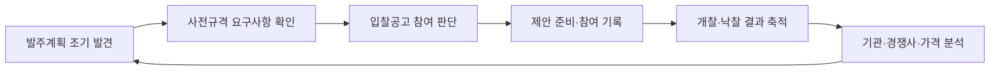
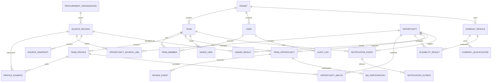

# iCore G2B 기회관리 플랫폼 PRD

> 키워드 수집기에서 팀별 입찰 기회관리 도구로 전환하기 위한 제품 요구사항 문서

> 현재/계획 경계: 이 문서는 팀·Opportunity 중심의 목표 제품을 정의한다. `현재 시스템`은 초안 작성일(2026-07-15)의 기준선이며, 현재 구현된 개인별 개찰결과 MVP는 [UX 명세](opening-results-ux-spec.md)와 [시스템 아키텍처](../architecture/system-architecture.md)를 기준으로 한다. 2026-07-20에 랜딩 프런트·백엔드 코드는 제거했지만 DB·GCS 잔존 자산은 삭제하지 않았다.

| 항목 | 내용 |
| --- | --- |
| 문서 상태 | Draft v0.1 |
| 작성일 | 2026-07-15 |
| 제품명(가칭) | iCore G2B |
| 제품 성격 | 사내 G2B 사업기회 탐색·검토·성과관리 플랫폼 |
| 핵심 결정 | 랜딩 페이지 빌더와 랜딩 페이지 관리 기능을 완전히 제거하고 G2B 전용 제품으로 재구축한다. |
| 구현 전략 | 기존 수집 인프라는 선별 재사용하고 제품 도메인·DB·API·화면은 새로 설계한다. |
| 초기 사용자 | 대학교·공공기관 사업 담당팀, 교육청 연수사업 담당팀, 시스템 관리자 |
| 일정·예산 | 별도 확정 필요 |

---

## 1. 문서 목적

이 문서는 현재 iCore에 부가 기능으로 포함된 G2B 수집기를 별도의 **입찰 기회관리 제품**으로 재정의한다.

이번 작업은 기존 화면에 필터 몇 개를 추가하는 고도화가 아니다. 현재 코드에서 검증된 수집·스케줄·중복 제거·알림·실행 이력의 패턴만 재사용하고, 다음 영역은 신규 제품 수준으로 다시 만든다.

- 팀별 사업 기준과 기관 범위
- 기관코드·상위기관 기반 기관 분류
- 회사 조달 자격 기반 참여 가능성 판정
- 발주계획부터 낙찰까지 이어지는 사업기회 관리
- 변경 이력, 검토 결과, 참여·수주·탈락 데이터 축적
- 팀별 알림과 성과·경쟁사 분석

제품의 최종 목표는 다음과 같다.

> 사용자가 복잡한 검색식을 작성하지 않아도, 각 팀이 검토해야 할 사업만 근거와 함께 보여주고 발주계획부터 낙찰 결과까지 하나의 흐름으로 관리한다.

---

## 2. 제품 재정의

### 2.1 한 문장 정의

**iCore G2B는 조달 데이터를 수집하는 도구가 아니라, 팀별 기준으로 사업을 발견하고 참여 가능성을 판단하며 결과를 축적하는 사내 입찰 기회관리 도구다.**

### 2.2 핵심 업무 흐름



### 2.3 개발 원칙

1. **공고가 아니라 사업기회 단위로 관리한다.**
2. **키워드보다 팀의 업무 기준을 우선한다.**
3. **관련성 판단과 입찰 자격 판단을 분리한다.**
4. **판정 결과와 판정 근거를 함께 보여준다.**
5. **모호한 데이터는 자동 제외하지 않고 `확인 필요`로 남긴다.**
6. **DB를 기준 데이터로 사용하고 Google Sheet는 보조 출력으로 사용한다.**
7. **AI 없이 설명 가능한 규칙 기반 MVP를 먼저 만든다.**
8. **발주계획은 확정 정보가 아니라 조기 감지용 참고 신호로 표시한다.**

---

## 3. 배경과 문제 정의

### 3.1 사용자 인터뷰에서 확인한 문제

#### 문제 A. 키워드 검색 노이즈

- `연수`, `AI`처럼 넓은 단어를 검색하면 관련 없는 시설·물품·유지보수 사업까지 함께 나온다.
- 예를 들어 포함 키워드 `연수`는 필요한 직무연수 사업뿐 아니라 `연수구`, `연수원`까지 가져올 수 있다.
- 현재 시스템은 공고를 자동으로 모으지만, 어떤 공고를 볼지는 담당자가 다시 판단한다.
- 관련 없는 공고가 이메일로 반복 도착해 알림 신뢰도가 낮아진다.

#### 문제 B. 팀별 기준 부재

- 교육청 담당팀과 대학교·공공기관 담당팀은 대상 기관과 사업 유형이 다르다.
- 대학교 사업에는 대학 본체뿐 아니라 산학협력단이 포함될 수 있다.
- 공공기관 사업에는 산하기관과 테크노파크 등 이름만으로 유형을 알기 어려운 기관이 포함된다.
- 사용자가 `&`, `|` 연산자를 직접 조합하는 방식은 업무 담당자에게 복잡하다.

#### 문제 C. 실제 참여 자격을 판단하지 못함

- 현재 검색은 `교육`, `AI`, `클라우드`, `직업훈련`, `콘텐츠`, `LMS` 같은 키워드 중심이다.
- 회사의 등록업종, 공급물품, 세부품명번호, 면허, 지역 제한과 공고의 참가자격을 비교하지 않는다.
- 내용은 관련 있어도 실제 입찰이 불가능한 공고가 검토 목록에 남는다.

#### 문제 D. 사업 생애주기가 연결되지 않음

- 발주계획, 사전규격, 입찰공고가 각각 별도 목록으로 존재한다.
- 같은 사업을 여러 번 확인해야 하고, 본공고가 나오기 전에 준비하기 어렵다.
- 발주계획의 예산과 예정월이 바뀌어도 변경 전후를 알 수 없다.

#### 문제 E. 결과가 수작업으로 흩어짐

- 담당자가 개찰·낙찰 결과를 확인해 Excel로 다시 정리한다.
- 참여 여부, 수주·탈락, 경쟁사, 낙찰금액, 낙찰률, 담당자 판단이 시스템에 남지 않는다.
- 다음 제안과 가격 전략에 사용할 근거 데이터가 축적되지 않는다.

### 3.2 현재 시스템의 구조적 한계

| 영역 | 현재 구현 | 한계 |
| --- | --- | --- |
| 설정 | 전역 `scraper_configs` 1건 | 팀·조직·사용자별 기준이 없음 |
| 검색 | 공고명 `bidNtceNm`, 사전규격 품명 `prdctClsfcNoNm` 키워드 | 기관 유형·사업 유형·자격 조건을 표현하지 못함 |
| 저장 | 최소 공고 필드와 `dedup_key` | 원문, 유입 조건, 소스 유형, 상세 자격정보가 보존되지 않음 |
| 연결 | 사전규격·공고를 별도 처리 | 같은 사업의 연속성이 없음 |
| 결과 | 실행 건수와 오류만 기록 | 사용자 검토·참여·낙찰 성과가 없음 |
| 출력 | Sheet와 이메일 중심 | 분석 가능한 내부 기준 데이터가 없음 |
| 알림 | 전역 키워드 결과를 수신자에게 발송 | 팀별 적합 공고만 보내지 못함 |
| 운영 | 저장소에 Gmail API와 Apps Script 경로가 함께 존재 | 운영에서 실제 활성화된 경로를 확인해야 함 |

---

## 4. 현재 코드 처리 원칙

### 4.1 결론: 기반은 재사용하고 제품은 새로 만든다

권장 방식은 **Brownfield infrastructure + Greenfield product domain**이다.

- 기존 G2B 수집 코드를 그대로 확장하지 않는다.
- 검증된 연결 패턴과 파싱 코드는 신규 모듈로 옮겨 재사용한다.
- 랜딩 페이지 도메인과 결합된 서비스·DB·화면을 제거한다.
- 신규 DB 스키마와 API를 기준으로 기존 데이터를 필요한 범위에서만 이관한다.

### 4.2 상태별 분류

| 상태 | 범위 | 처리 |
| --- | --- | --- |
| 재사용 후보 | React/Vite 기본 셸, FastAPI·SQLAlchemy 골격, Cloud Scheduler, Cloud Run 워커, G2B JSON/XML 파싱, 조회 윈도우, 실행 이력 패턴 | 코드 검토 후 신규 모듈로 이동 |
| 재설계 | 인증, 수집 설정, 중복 제거, Sheet·메일, 공고 저장, 운영 API | 팀·Opportunity·재시도 구조에 맞춰 교체 |
| 신규 구축 | 팀 프로필, 기관 마스터, 회사 자격, 발주계획, 변경 스냅샷, Opportunity, 검토·참여·낙찰·분석 | 새 DB·API·화면 구축 |
| 완전 제거 | 랜딩 페이지 빌더, 랜딩 페이지 관리, HTML 렌더링, GCS 랜딩 배포, 랜딩 DB 테이블과 시드 | 백업 확인 후 코드·데이터·인프라 폐기 |

### 4.3 현재 구현으로 확인된 재사용 후보

- 수집기 설정·실행·실행 이력 API: [`scraper.py`](https://github.com/sakolok/iCORE-G2B/blob/back/app/routers/scraper.py)
- Cloud Scheduler 동기화: [`cloud_scheduler_service.py`](https://github.com/sakolok/iCORE-G2B/blob/back/app/services/cloud_scheduler_service.py)
- 입찰공고·사전규격 수집과 Google API 연결: [`g2b_worker/main.py`](https://github.com/sakolok/iCORE-G2B/blob/back/cloudrun/g2b_worker/main.py)
- 현재 공고·실행 이력 모델: [`models.py`](https://github.com/sakolok/iCORE-G2B/blob/back/app/data/models.py)
- 개찰결과 검토 화면: [`OpeningResultsPage.jsx`](https://github.com/sakolok/iCORE-G2B/blob/front/src/pages/OpeningResultsPage.jsx)

위 항목은 저장소 코드에서 확인된 구현 범위다. 2026-07-20에 GCP 리소스 목록은 읽기 전용으로 확인했지만 실제 운영 수집·배포 실행은 이 문서 검토에서 다시 호출하지 않았으므로 Phase 0 운영 검증은 유지한다.

기존 `platform_service.py`의 수집 코드는 `app/g2b/bid_notices/service.py`로 분리됐다. Cloud Run 워커와 남은 대형 도메인 서비스는 후속 리팩터링에서 다음 단위로 나눈다.

```text
g2b/
  source_clients/          # 발주계획·사전규격·공고·낙찰 API 클라이언트
  normalization/          # 원문 → 내부 표준 모델
  organizations/          # 기관코드·상위기관·별칭
  profiles/               # 팀·회사 프로필
  opportunities/          # 사업기회 연결·상태
  matching/               # 관련성 판정
  qualifications/         # 참여 자격 판정
  results/                # 개찰·낙찰·참여 성과
  notifications/          # SMTP·Sheet·Outbox
  operations/             # 실행 이력·재처리·모니터링
```

### 4.4 신규 제품에서 반드시 해소할 현재 기술 부채

- 전역 설정 1건과 쉼표 문자열 저장을 팀별 정규화 모델로 교체한다.
- 외부 API 페이지네이션을 끝까지 처리한다.
- `partial` 실행이 다음 조회 커서를 전진시켜 데이터를 누락시키지 않게 한다.
- 수집 데이터의 소스 유형과 어떤 키워드·규칙으로 유입됐는지 DB에 보존한다.
- 공고를 중복 처리 완료로 표시하는 시점과 알림 성공 여부를 분리한다.
- 복수 Sheet ID 입력과 실제 첫 번째 Sheet만 사용하는 동작 차이를 제거한다.
- Scheduler가 미설정된 경우 실제 실행 없이 성공처럼 보이는 응답을 제거한다.
- Gmail API와 Apps Script로 나뉜 실행 경로를 한 개의 운영 경로로 통합한다.
- 시작 시 `create_all`과 런타임 `ALTER TABLE` 대신 버전 관리되는 DB 마이그레이션을 도입한다.
- 만료 없는 토큰, 기본 관리자 비밀번호, 기본 secret, 전체 허용 CORS를 제거한다.

### 4.5 랜딩 페이지 제거 범위

> 구현 상태(2026-07-20): 프런트·백엔드 랜딩 코드는 제거했고 전체 백엔드 테스트와 격리 API 기동을 검증했다. GCP에는 배포된 `landings/` 객체와 CDN 자원이 없으며 사이트 템플릿 JSON 3개만 남아 있다. 로컬 DB의 `landing_pages` 0행과 `landing_templates` 3행은 보존했고, Cloud SQL 테이블 데이터와 GCS 객체는 삭제하지 않았다.

#### 프런트엔드

- `LandingBuilder.jsx` 및 관련 CSS·템플릿 JSON
- `SiteManager.jsx` 및 관련 CSS
- `FutureModules.jsx` 범용 준비 화면
- `builderApi`, `siteApi`
- 랜딩 페이지 메뉴와 기본 진입값
- 랜딩 페이지 중심 로그인·브랜드 문구

#### 백엔드

- `app/routers/builder.py`
- `app/routers/site_manager.py`
- `app/services/storage_deployer.py`
- 랜딩 HTML 렌더링·이미지 변환·GCS 배포·사이트 CRUD
- `LandingTemplateModel`, `LandingPageModel`
- 랜딩 관련 Pydantic 스키마와 기본 템플릿 시드
- 랜딩 전용 GCS·CDN 설정과 사용하지 않는 의존성
- 저장소에 남아 있다면 부트캠프 랜딩 템플릿 원본 소스

#### 데이터·인프라

- `landing_templates`, `landing_pages` 데이터 백업
- 랜딩용 GCS 객체와 CDN·Load Balancer 사용 여부 확인
- 보존 정책과 소유자 승인 후 테이블·버킷·라우팅 제거

Load Balancer처럼 G2B API·프런트와 공유하는 자원은 삭제하지 않고 랜딩 전용 라우팅과 백엔드만 분리해 제거한다.

> 운영 데이터가 있다면 화면이나 테이블을 먼저 삭제하지 않는다. 백업 파일의 복원 테스트와 보존기간 승인을 완료한 후 폐기한다.

### 4.6 데이터 전환·롤백 정책

1. 기존 DB와 GCS의 시점 백업을 만들고 복원 테스트를 수행한다.
2. 신규 G2B 스키마를 기존 스키마와 분리해 배포한다.
3. 기존 데이터를 다음 원칙으로 백필한다.
   - `scraper_notices`: 가능한 필드를 `source_records`로 이관하고 소스가 불명확하면 `LEGACY_UNKNOWN`으로 표시
   - `scraper_runs`: 운영 이력용으로 이관하거나 별도 읽기 전용 보관
   - `scraper_configs`: 자동 변환하지 않고 담당자 확인 후 초기 Team Profile의 참고값으로만 사용
   - 랜딩 데이터: 신규 G2B 도메인으로 이관하지 않음
4. 신규 수집기를 기존 수집기와 병행 실행해 소스별 건수와 누락을 비교한다.
5. 기준을 통과하면 신규 API·화면·알림으로 전환한다.
6. 합의된 롤백 기간 동안 기존 DB와 실행 경로를 읽기 전용으로 보존한다.
7. 롤백 기간 종료와 소유자 승인을 확인한 후 레거시 코드·테이블·인프라를 제거한다.

백필 기간과 롤백 기간은 운영 데이터량과 법적·업무상 보존 요구를 확인한 후 확정한다.

---

## 5. 목표와 비목표

### 5.1 제품 목표

1. 팀별로 원하는 사업 기준을 저장하고 공유한다.
2. 복잡한 Boolean 검색식 없이 대상 기관·사업 유형·포함·제외 기준을 설정한다.
3. 검색 결과를 `우선 검토`, `확인 필요`, `제외`로 분류하고 이유를 보여준다.
4. 기관코드와 회사 조달 자격을 이용해 참여 가능성을 1차 판정한다.
5. 발주계획·사전규격·입찰공고·개찰/낙찰을 하나의 Opportunity로 연결한다.
6. 예산·예정월·마감·상태 등 중요 변경을 스냅샷으로 저장하고 알린다.
7. 실제 참여, 수주·탈락, 담당자 메모를 축적한다.
8. 기관별 반복 발주, 경쟁사, 예산과 낙찰률을 분석한다.
9. 팀별 적합 공고만 이메일로 발송해 무관 알림을 줄인다.
10. 수집·판정·알림의 실패 원인을 추적하고 안전하게 재처리한다.

### 5.2 비목표

- 랜딩 페이지 생성·배포·운영
- 나라장터 입찰서 자동 제출
- 제안서 자동 작성
- 시스템이 최종 입찰 참여 여부를 대신 결정하는 기능
- MVP에서 생성형 AI가 자동으로 모든 공고를 분류하는 기능
- 모든 제안요청서 PDF/HWP의 2단계 평가점수를 완전 자동 추출하는 기능
- 나라장터 외 모든 민간 조달 플랫폼 통합

---

## 6. 사용자와 권한

### 6.1 주요 사용자

| 사용자 | 주요 업무 | 필요한 기능 |
| --- | --- | --- |
| 팀장 | 팀 사업 범위와 우선순위 정의 | 팀 프로필 승인, 검토 우선순위, 성과 확인 |
| 사업 담당자 | 공고 검토·제안 준비·결과 기록 | 검토 목록, 상세, 상태·메모, 참여·결과 입력 |
| 운영 관리자 | 수집기·기관·회사 자격·연동 관리 | API 연동, 기관 마스터, 자격, 재처리, 감사 로그 |
| 경영·영업 관리자 | 성과와 시장 패턴 확인 | 기관·경쟁사·예산·낙찰률 분석 |

### 6.2 권한 모델

| 역할 | 권한 |
| --- | --- |
| `SYSTEM_ADMIN` | 조직·팀·사용자·연동·수집 운영 전체 관리 |
| `TEAM_LEAD` | 소속 팀 프로필·수신자·검토 정책 관리, 팀 성과 조회 |
| `TEAM_MEMBER` | 소속 팀 기회 검토, 상태·메모·참여 결과 입력 |
| `VIEWER` | 허용된 팀의 조회·분석만 가능 |

모든 수정 작업은 사용자, 시각, 변경 전후 값을 감사 로그에 남긴다.

### 6.3 초기 팀 프로필 예시

아래 값은 인터뷰를 기반으로 한 **초기 초안**이며 팀장 확인 후 확정한다.

#### 대학교·공공기관 담당팀

- 대상 기관
  - 대학교
  - 산학협력단
  - 공공기관
  - 공공기관 산하기관
  - 테크노파크
- 주력 용역
  - 클라우드 기반 교육
  - AI 교육
  - 프로그래밍 교육
  - 부트캠프
- 물품
  - 크롬북 소규모 납품
- 사용자 경험
  - `&`, `|` 연산자 입력 없이 화면에서 조건 선택
  - 팀 기준과 맞는 결과만 메일 수신

#### 교육청 연수사업 담당팀

- 대상 기관: 교육청, 교육지원청
- 주력 용역: 교원연수, 직무교육, AI·디지털·진로 교육
- 대표 제외 후보: 시설, 단순 물품, 무관 유지보수
- 모호한 공고: 자동 제외하지 않고 원문 확인

---

## 7. 핵심 도메인 정의

### 7.1 Team Profile

팀이 찾는 기관·사업·예산·지역·포함·제외 기준과 알림 수신자를 저장한 설정이다.

### 7.2 Company Qualification Profile

회사가 나라장터에 등록한 업종, 공급물품, 세부품명, 면허·인증, 소재지와 입찰 가능 지역을 저장한 기준이다.

### 7.3 Organization Master

수요기관코드, 기관명, 최상위기관, 상위기관, 기관유형, 별칭을 관리한다. 대학과 산학협력단, 공공기관과 산하기관처럼 이름이 달라도 같은 기관군으로 판정하는 기준이다.

### 7.4 Source Record

발주계획, 사전규격, 입찰공고, 개찰·낙찰 API에서 수집한 원문 레코드다. 원본 응답과 표준화된 필드를 함께 보존한다.

### 7.5 Opportunity

동일한 사업에 속하는 발주계획·사전규격·입찰공고·개찰/낙찰 레코드를 묶은 내부 사업기회다.

### 7.6 Match

Opportunity와 Team Profile을 비교한 관련성 판정이다.

- `PRIORITY`: 팀 기준에 명확히 부합
- `REVIEW`: 일부 정보가 없거나 모호해 사람 확인 필요
- `EXCLUDE`: 명시적인 제외 기준과 일치

### 7.7 Eligibility

Opportunity의 참가 조건과 Company Qualification Profile을 비교한 자격 판정이다.

- `ELIGIBLE`: 확인 가능한 필수 조건 충족
- `CHECK`: 공고 원문이나 첨부문서 확인 필요
- `INELIGIBLE`: 명확한 필수 조건 불충족

관련성과 자격은 별도 값으로 저장한다. 예를 들어 사업은 매우 관련 있지만 지역 제한이 불명확하면 `PRIORITY + CHECK`로 표시한다.

---

## 8. 사용자 입력 요구사항

### 8.1 팀장에게 받아야 할 값

| 구분 | 입력값 | 예시 |
| --- | --- | --- |
| 기관 범위 | 대상 기관 유형 | 대학교, 산학협력단, 공공기관, 산하기관, 테크노파크 |
| 기관 예시 | 반드시 포함할 기관명·기관코드 | 특정 대학, 특정 테크노파크 |
| 기관 제외 | 제외할 기관·기관군 | 해당 팀이 담당하지 않는 기관 |
| 사업 유형 | 찾으려는 용역·물품 유형 | AI 교육, 클라우드 교육, 부트캠프, 크롬북 |
| 필수 조건 | 반드시 포함되어야 하는 개념 | 교육 운영, 연수, 실습 등 |
| 우선 조건 | 있으면 우선순위를 높일 개념 | 생성형 AI, 클라우드 실습 등 |
| 제외 조건 | 무관 사업을 판별할 개념 | 시설, 보수, 공사 등 팀별 확인값 |
| 업무 구분 | 용역·물품 등 | 용역 우선, 크롬북 물품 허용 |
| 금액 | 최소·최대 또는 선호 구간 | 팀 확인 필요 |
| 지역 | 지역 제한 허용 범위 | 전국, 본점 소재지, 특정 지역 |
| 사례 | 원하는 공고와 원하지 않는 공고 | 각각 최소 10건 권장 |
| 알림 | 수신자·시간·긴급 기준 | 신규 우선검토, 마감 임박, 중요 변경 |

### 8.2 회사에서 받아야 할 값

- 사업자등록번호
- 나라장터 조달업체 등록정보 조회 기준
- 등록업종코드와 업종명
- 공급물품과 세부품명번호
- 보유 면허·인증과 유효기간
- 본점·지점 소재지
- 참여 가능한 지역
- 공동수급 가능 여부와 내부 정책
- 과거 참여·수주·탈락 Excel 또는 Sheet

### 8.3 입력 UX 원칙

사용자는 Boolean 식을 직접 작성하지 않는다. 화면에서 다음 항목을 선택하면 시스템이 내부 규칙으로 변환한다.

```text
[대학교·산학협력단·공공기관 계열]이 발주하고
[클라우드 교육·AI 교육·프로그래밍 교육·부트캠프] 중 하나에 해당하며
[시설·공사 등 팀 제외 조건]에 해당하지 않는 사업을 찾는다.
```

저장 전 최근 공고를 대상으로 예상 결과를 미리 보여준다.

- 예상 우선 검토 건수
- 예상 확인 필요 건수
- 예상 제외 건수
- 포함된 이유와 제외된 이유

---

## 9. 기능 요구사항

우선순위는 `P0=MVP 필수`, `P1=후속 필수`, `P2=확장`으로 정의한다.

### FR-01. 조직·팀·사용자 관리 — P0

- 조직 안에 여러 팀을 생성한다.
- 사용자를 팀과 역할에 연결한다.
- 사용자는 허용된 팀 데이터만 볼 수 있다.
- 팀별 기본 담당자와 알림 수신자를 관리한다.

**완료 조건**

- 두 팀이 서로 다른 프로필과 메일 수신자를 가질 수 있다.
- 팀 구성원이 다른 팀의 비공개 메모를 조회하지 못한다.

### FR-02. 팀 프로필 편집기 — P0

- 대상 기관 유형과 특정 기관을 다중 선택한다.
- `산하기관 포함` 옵션을 제공한다.
- 사업 유형, 업무 구분, 금액, 지역을 선택한다.
- 필수·우선·제외 조건을 태그로 입력한다.
- 원하는/원하지 않는 공고 예시를 등록한다.
- 저장 전 최근 데이터로 결과를 미리 검증한다.
- 프로필 버전과 변경 이력을 저장한다.
- 새 프로필 버전이 활성화되면 진행 중인 Opportunity를 비동기로 재판정한다.
- 과거 Match는 당시 사용한 프로필 버전과 함께 보존하고 덮어쓰지 않는다.

**완료 조건**

- 사용자가 `&`, `|` 문자를 입력하지 않고 프로필을 만들 수 있다.
- 같은 공고가 팀마다 다른 결과로 분류될 수 있다.
- 프로필 변경 전후의 판정 결과를 비교할 수 있다.

### FR-03. 기관 마스터와 기관 분류 — P0

- 수요기관코드, 기관명, 최상위기관코드·명, 주소, 기관 유형을 저장한다.
- 대학·산학협력단, 공공기관·산하기관·테크노파크 관계를 표현한다.
- 명칭 별칭과 수동 보정값을 관리한다.
- 공식 코드가 없거나 분류가 모호한 기관은 `미분류` 큐로 보낸다.
- 수동 보정은 이후 같은 기관에 재사용한다.

**완료 조건**

- 산학협력단이 대학 계열 규칙에 포함된다.
- 테크노파크가 공공기관 계열 규칙에 포함될 수 있다.
- 상위기관이 바뀌면 영향받는 프로필을 확인할 수 있다.

### FR-04. 회사 자격 프로필 — P1

- 조달업체 기본정보, 등록업종, 공급물품을 동기화한다.
- 수동 면허·인증과 유효기간을 추가할 수 있다.
- 지역과 공동수급 정책을 저장한다.
- 변경 이력을 기록한다.

**완료 조건**

- 어떤 회사 자격값으로 공고를 판정했는지 추적할 수 있다.
- 만료된 자격은 자동으로 `CHECK` 또는 `INELIGIBLE` 사유가 된다.

### FR-05. 조달 데이터 수집 — P0

- 발주계획, 사전규격, 입찰공고를 수집한다.
- 개찰·낙찰은 P1에서 추가한다.
- 페이지네이션을 끝까지 처리한다.
- 조회 구간에 겹침 구간을 두어 지연 등록·부분 실패 누락을 줄인다.
- 원문 응답, 원문 해시, 수집 시각, 외부 키를 저장한다.
- 같은 실행을 반복해도 중복 생성되지 않아야 한다.
- 부분 실패한 소스만 안전하게 재실행할 수 있어야 한다.

**완료 조건**

- API 전체 페이지의 수집 건수와 저장 건수가 검증된다.
- `partial` 실행이 다음 수집 구간을 잘못 전진시키지 않는다.
- 전송 실패가 발생해도 원본 데이터는 다시 알림 처리할 수 있다.

### FR-06. 변경 스냅샷과 변경 감지 — P0

- 동일 외부 레코드의 이전 버전과 현재 버전을 저장한다.
- 다음 중요 필드의 변경 이벤트를 생성한다.
  - 예산·추정가격·기초금액
  - 발주예정월
  - 제안마감·입찰마감
  - 기관
  - 지역 제한·참가자격
  - 상태·취소·재공고
- 변경 전후 값과 감지 시각을 보여준다.

**표시 예시**

```text
○○대학교 AI 교육 운영 용역
예산: 100,000,000원 → 80,000,000원
발주예정월: 8월 → 9월
상태: 확인 필요
```

### FR-07. Opportunity 연결 — P0

연결 우선순위는 다음과 같다.

1. 계약과정 통합정보 또는 소스가 제공하는 공식 연결번호
2. 발주계획번호·사전규격등록번호·입찰공고번호 등 명시적 참조
3. 기관코드 정확 일치 + 정규화 사업명 + 예산·시기 보조 매칭
4. 신뢰도가 낮은 경우 자동 병합하지 않고 연결 검토 큐 생성

각 연결은 `연결 근거`, `신뢰도`, `자동/수동`, `처리자`를 저장한다.

**완료 조건**

- 하나의 상세 화면에서 발주계획→사전규격→본공고를 시간순으로 볼 수 있다.
- 잘못 연결된 항목을 분리하고 이력을 남길 수 있다.
- 발주계획이 존재하지 않는 공고도 독립 Opportunity로 생성할 수 있다.

### FR-08. 관련성 판정 — P0

수집 단계의 1차 키워드 규칙은 다음과 같다.

1. 포함 키워드는 OR 조건으로 판정한다. `AI`, `클라우드`, `연수` 중 하나라도 사업명에 있으면 후보가 된다.
2. 제외 키워드는 포함 조건보다 우선한다. `연수구`, `연수원` 중 하나라도 있으면 후보에서 제외한다.
3. 개찰결과의 포함·제외 키워드는 코드에 고정하지 않고 인증된 사용자가 본인 프로필의 태그
   목록으로 관리한다. 향후 Opportunity 팀 프로필은 이 개인 개찰결과 프로필과 분리한다.
4. 비교는 Unicode 정규화와 영문 대소문자 무시 후 수행한다.
5. 기관명·업체명·공고번호는 키워드 판정 대상에 넣지 않는다. 기관명이 `연수구`여도 사업명이 `AI 교육`이면 수집한다.
6. 개찰결과 공통 원본은 먼저 한 번 저장한다. 제외 판정은 활성 사용자별 받은 목록을 만들기 전에 수행하며, 제외된 항목은 Sheet·메일로 보내지 않는다.

판정 순서는 다음과 같다.

1. 대상 기관 범위
2. 업무 구분과 사업 유형
3. 필수·우선·제외 조건
4. 금액·마감과 팀 선호 조건
5. 데이터 누락 여부

팀이 선호하는 사업 수행 지역은 관련성 조건으로 사용할 수 있지만, 공고의 법적 참가가능지역 충족 여부는 FR-09 자격 판정에서 처리한다.

각 결과에 사람이 읽을 수 있는 이유를 저장한다.

```text
우선 검토
- 대상 기관: 공공기관 산하기관
- 사업 유형: AI 교육
- 우선 조건: 생성형 AI, 실습 운영
```

```text
확인 필요
- 대상 기관은 일치
- 사업 유형은 일치
- 지역 제한 정보가 없어 공고 원문 확인 필요
```

### FR-09. 참여 자격 판정 — P1

- 공고 상세의 업종·면허 제한을 회사 등록업종과 비교한다.
- 세부품명번호·공급물품을 비교한다.
- 참가가능지역을 회사 소재지·정책과 비교한다.
- 원문 첨부에서만 확인 가능한 조건은 `CHECK`로 남긴다.
- 명확한 불충족만 `INELIGIBLE`로 판정한다.
- 모든 판정은 수동 변경할 수 있고 변경 사유가 필요하다.

### FR-10. 검토 목록과 상세 화면 — P0

#### 검토 목록

- 팀, 관련성, 자격, 단계, 기관, 사업 유형, 금액, 마감일로 필터링한다.
- 신규, 변경, 마감 임박, 담당자 미지정 항목을 구분한다.
- 판정 결과뿐 아니라 핵심 판정 이유를 한 줄로 보여준다.
- 저장된 보기와 공유 가능한 URL을 제공한다.

#### 상세 화면

- Opportunity 요약
- 단계별 타임라인
- 변경 이력
- 관련성·자격 판정과 근거
- 원문 링크·첨부 링크
- 담당자·검토 상태·메모
- 참여 여부·제안 상태·결과

### FR-11. 검토·참여 워크플로 — P1

- 검토 상태·담당자·메모는 Opportunity 전역 값이 아니라 `team_opportunities`에 팀별로 저장한다.
- 검토 상태: `NEW`, `REVIEWING`, `WATCHING`, `DECLINED`, `PARTICIPATING`, `CLOSED`
- 담당자와 내부 마감일을 지정한다.
- 참여·미참여와 사유를 기록한다.
- 수주·탈락·유찰·재입찰을 기록한다.
- 모든 상태 변경을 타임라인에 남긴다.

### FR-12. 개찰·낙찰·경쟁사 데이터 — P1

- 공고번호·공고차수·개찰회차를 기준으로 개찰완료·재입찰·유찰·최종낙찰자 정보를 해당 입찰공고 Source Record에 연결한다.
- Opportunity에는 연결된 입찰공고의 결과를 집계해 보여주며, 재공고와 복수 개찰 결과를 덮어쓰지 않는다.
- 낙찰업체, 낙찰금액, 예정가격, 낙찰률, 개찰순위를 저장한다.
- 사내 참여 여부, 수주·탈락, 담당자 메모를 함께 저장한다.
- 2단계 입찰 평가점수는 공개 형식에 따라 다음처럼 처리한다.
  - 표준 API에 있으면 자동 저장
  - 첨부문서에만 있으면 수동 입력 또는 후속 문서 파싱
  - 공개되지 않으면 `미공개`로 표시

### FR-13. 팀별 알림 — P0

- 팀 프로필별로 알림 수신자를 관리한다.
- `PRIORITY`와 설정된 `REVIEW`만 보낸다.
- 신규 기회, 중요 변경, 마감 임박을 구분한다.
- 일일 요약과 긴급 알림 정책을 분리한다.
- 같은 이벤트를 중복 발송하지 않는다.
- 발송 실패는 Outbox에 남겨 재시도한다.
- 이메일에는 판정 근거와 상세 화면 링크를 포함한다.

MVP 운영 중에도 활성 메일 경로는 하나만 둔다. SMTP Relay 전환 전에는 현재 Gmail API를 임시로 사용할 수 있지만 Apps Script 경로는 비활성화한다. 최종 목표는 Google Workspace SMTP Relay이며 전환 완료 후 기존 Gmail API·Apps Script 경로를 제거한다.

### FR-14. Google Sheet·Excel 출력 — P1

- DB를 기준 데이터로 사용한다.
- 팀별 저장 보기 또는 참여 현황을 Sheet/Excel로 내보낸다.
- 기존 담당자가 사용하는 기본 컬럼을 제공한다.
  - 공고번호
  - 사업명·공고명
  - 수요기관
  - 진행상태
  - 추정가격·기초금액·부가세
  - 제안마감일
  - 지역 제한
  - 담당자
  - 참여 여부
  - 수주·탈락 결과
- Sheet 수정값을 기준 데이터로 다시 가져오는 기능은 MVP에서 제외한다.

#### 개찰결과 정리 Sheet 고정 계약

개찰결과 담당자가 출력하는 Sheet는 다음 17개 열을 순서대로 사용한다.

1. 공고번호
2. 사업명
3. 발주처
4. 기초금액
5. 제안마감
6. 지역제한여부
7. 2단계 입찰(여부)
8. 1위(이름)
9. 1위 총점(점수)
10. 2위(이름)
11. 2위 총점(점수)
12. 3위(이름)
13. 3위 총점(점수)
14. 4위(이름)
15. 4위 총점(점수)
16. 5위(이름)
17. 5위 총점(점수)

- `발주처`는 입찰공고의 수요기관명 `dminsttNm`을 공식 명칭 그대로 사용한다.
- 각 순위의 총점은 `입찰가격점수(bidPrceEvlVal)+기술평가점수(techEvlVal)=합계` 형식으로 기록한다. 합계는 `ROUND_HALF_UP`으로 소수 둘째 자리까지 반올림하며 예시는 `10+85.5=95.50`이다.
- 두 점수 중 하나라도 공개되지 않으면 `0`을 만들지 않고 빈 값으로 둔다.
- 공식 응답의 종합평가점수 `totalEvlAmtVal`은 계산값을 덮어쓰지 않고 비교·감사용으로 별도 보존한다.
- DB에는 재입찰을 포함한 모든 개찰 회차를 보존한다.
- 프론트에는 기본적으로 최근 14일의 개찰결과만 표시하며, 화면 새로고침은 DB만 조회하고 나라장터 API를 다시 호출하지 않는다.
- 사용자가 화면에서 결과를 체크하고 최종 확인한 항목만 Sheet에 반영한다. 수집된 전체 목록을 자동으로 기록하지 않는다.
- 프론트는 선택한 개찰결과 ID만 기준값으로 전달하며, 사업명·수요기관명·기초금액·제안마감·지역제한여부·2단계 입찰 여부는 서버가 공고번호와 차수로 입찰공고 DB에서 조회한다.
- 입찰공고 DB에서 필수 정보가 연결되지 않았거나 동일 공고번호·차수의 공식 행이 여러 건이면 빈 행이나 추정값으로 내보내지 않고 Sheet 반영을 차단한다.
- Sheet 반영은 선택하지 않은 기존 행을 유지한다. 같은 공고번호가 이미 있으면 해당 행을 갱신하고 없으면 새 행을 추가한다.
- 기존행 갱신과 신규행 추가는 한 번의 Google Sheets 배치 요청으로 처리한다.
- 개찰결과 수집은 실시간 호출하지 않고 매일 `00:17`, `12:17` KST의 12시간 주기로 실행한다.
- 개찰결과 원본은 사용자별로 복제하지 않고 공통 테이블에 한 번만 저장한다. 저장 후 활성 사용자의 포함·제외 키워드로 사용자별 받은 목록을 만든다.
- 인증된 사용자는 조직 역할과 관계없이 본인 포함·제외 키워드와 활성 여부를 편집한다. 저장하면 외부 API 호출 없이 최근 14일 DB 원본을 해당 사용자에 대해 동기 재매칭한다.
- 신규 사용자는 비활성·빈 키워드 프로필로 시작한다. 전환 당시 기존 활성 사용자는 조직 프로필을 본인 프로필로 한 번 복사하고 이후에는 사용자별로 독립 관리한다.
- 사용자가 목록에서 제외한 결과와 개인 Sheet에 성공적으로 반영한 결과는 해당 사용자에게 다시 노출하지 않는다.
- 조직 공용 Sheet에 성공적으로 반영한 결과는 같은 조직 구성원 모두에게 다시 노출하지 않는다. Google API 실패 시에는 목록을 유지한다.
- 조직 역할과 조직 ID는 개찰결과 키워드 권한이 아니라 조직 공용 Sheet 권한과 기존 데이터 호환에만 사용한다.
- 재노출 방지 이력은 숫자 DB ID가 아니라 개찰결과의 안정적인 외부 고유키로 장기 보존해 원본 삭제·재수집 뒤에도 유지한다.
- 동일 12시간 슬롯의 중복 실행과 다음 실행에서 다시 받은 결과는 외부 고유키와 원문 해시로 중복 저장하지 않는다.
- 이전 성공 이후 놓친 수집 구간은 최근 14일 범위에서 자동 보충하고, 작업 소유 토큰으로 만료된 수집기가 새 수집 결과를 덮어쓰지 못하게 한다.
- 개찰 요약 공통 원본은 모두 저장하되 업체별 순위·점수 상세 API는 활성 사용자 조건 중 하나라도 매칭된 결과에만 한 번 호출하고, 여러 사용자가 같은 결과에 매칭되면 저장된 상세를 공유한다.
- Sheet 실제 반영 요청은 직전 미리보기 토큰을 포함해야 하며, 미리보기 이후 결과 또는 목적지가 바뀌면 다시 확인시킨다.

### FR-15. 분석 — P2

- 기관별 반복 발주 주기
- 기관별 평균 예산 규모
- 사업 유형별 낙찰률 범위
- 자주 만나는 경쟁사와 낙찰 빈도
- 유입 키워드·팀 규칙별 적합률
- 참여율·수주율·탈락 사유
- 발주계획 단계에서 발견한 사업 수

### FR-16. 수집 운영과 관리자 도구 — P0

- 소스별 마지막 성공 시각과 최신 데이터 시각을 표시한다.
- 실행별 입력·수집·저장·판정·알림 건수를 표시한다.
- 실패한 페이지·소스·알림을 재처리한다.
- 실제로 실행되지 않은 요청을 성공으로 표시하지 않는다.
- API 할당량, 지연, 오류율을 모니터링한다.
- 환경별 설정과 배포 상태를 확인한다.
- 개찰결과 수집과 Sheet 반영을 분리한다. 스케줄 수집은 DB 저장까지만 수행하고 Sheet 반영은 사용자 확인 이후에만 수행한다.

---

## 10. 데이터 소스와 연동 범위

구현 전 각 서비스의 최신 Swagger와 활용신청 계정을 다시 확인한다.

| 우선순위 | 공식 데이터 소스 | 용도 |
| --- | --- | --- |
| P0 | [나라장터 사용자정보 서비스](https://www.data.go.kr/data/15129466/openapi.do) | 수요기관코드·최상위기관, 조달업체 기본정보·등록업종·공급물품 |
| P0 | [나라장터 발주계획현황서비스](https://www.data.go.kr/data/15129462/openapi.do) | 조달대상, 예산액, 발주예정시기, 발주방법, 기관·연락처 |
| P0 | [나라장터 사전규격정보서비스](https://www.data.go.kr/data/15129437/openapi.do) | 사전규격등록번호, 사업명·품명, 배정예산, 규격서, 의견마감 |
| P0 | [나라장터 입찰공고정보서비스](https://www.data.go.kr/data/15129394/openapi.do) | 공고 목록·상세, 기초금액, 면허제한, 참가가능지역, 변경이력 |
| P1 | [나라장터 낙찰정보서비스](https://www.data.go.kr/data/15129397/openapi.do) | 최종낙찰자, 개찰순위, 재입찰·유찰, 예정가격·낙찰률 |
| P1 | [나라장터 계약과정통합공개서비스](https://www.data.go.kr/data/15129459/openapi.do) | 발주계획·사전규격·공고·낙찰·계약 연결 보조 |

### 10.1 데이터 완전성 원칙

- 모든 입찰에 발주계획이나 사전규격이 존재한다고 가정하지 않는다.
- 모든 공고에 개찰·낙찰 정보가 존재한다고 가정하지 않는다.
- API 필드가 비어 있으면 원문 첨부 확인 상태로 남긴다.
- 응답 원문을 보존해 필드 매핑 변경에 대응한다.
- 공식 외부 번호를 우선 키로 사용하고 제목 해시는 최후 보조키로만 사용한다.

### 10.2 대표 표준 필드

정확한 필드명은 활용 중인 오퍼레이션의 최신 명세로 확정한다.

| 영역 | 대표 필드 |
| --- | --- |
| 기관 | 수요기관코드·명, 공고기관코드·명, 최상위기관코드·명, 주소 |
| 발주계획 | 발주계획번호, 사업명, 예산액, 발주예정년월, 발주방법, 담당 연락처 |
| 사전규격 | 사전규격등록번호, 사업명·품명, 배정예산, 등록일, 의견마감, 규격서 URL |
| 입찰공고 | 공고번호·차수, 공고명, 업무구분, 추정가격, 기초금액, 부가세, 공고일, 마감일 |
| 참가조건 | 업종코드, 면허제한, 세부품명번호, 참가가능지역, 공동수급 조건 |
| 낙찰 | 개찰상태, 개찰순위, 업체명, 투찰금액, 낙찰금액, 예정가격, 낙찰률, 유찰·재입찰 |

---

## 11. 판정 규칙

### 11.1 관련성 판정

```text
기관 범위 일치
AND 업무 구분 허용
AND (사업 유형 일치 OR 필수/우선 개념 일치)
AND 명시적 제외 조건 불일치
```

단, 정보 누락 시 `EXCLUDE`가 아니라 `REVIEW`를 우선한다.

### 11.2 최종 검토 큐

| 관련성 | 자격 | 최종 큐 |
| --- | --- | --- |
| PRIORITY | ELIGIBLE | 우선 검토 |
| PRIORITY | CHECK | 확인 필요 |
| REVIEW | ELIGIBLE 또는 CHECK | 확인 필요 |
| EXCLUDE | 모든 값 | 제외 |
| PRIORITY 또는 REVIEW | INELIGIBLE | 제외 |

`INELIGIBLE`은 지역·업종·면허 등 필수 조건 불충족이 명확할 때만 사용한다. 정보 누락, 공동수급 가능성, 첨부문서 확인 필요처럼 불확실성이 있으면 반드시 `CHECK`로 판정한다. 사용자는 사유를 남기고 수동 예외 처리할 수 있다.

### 11.3 수동 판단

- 사용자는 자동 판정을 변경할 수 있다.
- 변경 시 사유를 선택하거나 메모한다.
- 수동 판단은 모델·규칙 개선용 데이터로 보존한다.
- 같은 유형의 오판이 반복되면 팀 프로필 수정 후보를 제안한다.

---

## 12. 데이터 모델 초안



| 엔티티 | 목적 | 주요 키·필드 |
| --- | --- | --- |
| `tenants` | 사내 회사·조직 | id, name |
| `teams` | 사업 담당팀 | tenant_id, name, active |
| `users` | 사용자 | tenant_id, identity_id, name, active |
| `team_members` | 팀 소속·역할 | team_id, user_id, role |
| `team_profiles` | 팀 기준 버전 | team_id, version, status, rules_json |
| `team_profile_rules` | 기관·사업·포함·제외 규칙 | profile_id, rule_type, operator, value |
| `profile_examples` | 원하는·원하지 않는 공고 사례 | profile_id, source_record_id 또는 snapshot, expected_result |
| `procurement_organizations` | 외부 수요·발주기관 분류 | external_code, name, parent_code, top_code, type, aliases |
| `company_profiles` | 입찰 회사 기준 | business_number, name, regions |
| `company_qualifications` | 업종·물품·면허 | type, code, name, valid_from, valid_to |
| `source_records` | 최신 외부 레코드 | source_type, external_key, normalized fields, raw_payload |
| `source_snapshots` | 원문 버전·변경 | source_record_id, payload_hash, payload, collected_at |
| `opportunities` | 팀과 무관한 공통 사업기회 사실 | stage, canonical_name, procurement_organization_id, budget |
| `opportunity_source_links` | 소스 연결 | opportunity_id, source_record_id, confidence, reason |
| `opportunity_matches` | 팀 관련성 판정 | opportunity_id, profile_id, result, score, reasons |
| `eligibility_results` | 회사 자격 판정 | opportunity_id, company_profile_id, result, reasons |
| `team_opportunities` | 팀별 현재 검토 상태 | team_id, opportunity_id, status, owner_user_id, internal_deadline, manual_result, memo |
| `review_events` | 팀별 검토·상태 이력 | team_opportunity_id, actor, action, before, after, note |
| `bid_participations` | 팀별 참여·성과 | team_opportunity_id, participated, result, owner_user_id, memo |
| `award_results` | 개찰·낙찰·경쟁사 | source_record_id, opportunity_id, bid_notice_no, bid_notice_ord, opening_round, rank, company, amount, rate |
| `saved_views` | 팀별 저장 필터 | team_id, owner_user_id, name, filters_json, shared |
| `collection_runs` | 수집 실행 | source, cursor, status, counts, error |
| `notification_events` | 팀별 알림 사건 | team_id, opportunity_id, event_type, event_key |
| `notification_outbox` | 채널별 알림 재시도 | notification_event_id, channel, recipient, status, attempts |
| `audit_logs` | 보안·변경 감사 | actor_user_id, action, target_type, target_id, before, after, created_at |

---

## 13. 화면 정보구조

| 화면 | 권장 경로 | 주요 내용 | 우선순위 |
| --- | --- | --- | --- |
| 대시보드 | `/dashboard` | 신규·변경·마감 임박·확인 필요·운영 오류 | P0 |
| 검토 목록 | `/opportunities` | 팀별 사업기회 검색·필터·저장 보기 | P0 |
| 사업기회 상세 | `/opportunities/:id` | 단계, 원문, 변경, 판정, 메모, 참여·결과 | P0 |
| 팀 프로필 | `/team-profiles` | 기관·사업·포함·제외·알림 기준 | P0 |
| 수집 운영 | `/operations` | 실행 상태, 오류, 재처리, API 할당량 | P0 |
| 기관 분류 | `/organizations` | 기관코드·상위기관·유형·별칭·미분류 큐 | P0 |
| 회사 자격 | `/qualifications` | 업종·물품·면허·지역 | P1 |
| 참여·성과 | `/results` | 참여, 수주·탈락, 낙찰·경쟁사 | P1 |
| 분석 | `/analytics` | 반복 발주, 경쟁사, 예산, 낙찰률, 적합률 | P2 |
| 연동 설정 | `/settings/integrations` | OpenAPI, SMTP Relay, Sheet, 모니터링 | P1 |

현재 프론트는 `OpeningResultsPage` 단일 화면이다. 목표 제품의 다중 화면을 도입할 때 URL 라우팅과 권한 가드를 함께 추가한다.

---

## 14. 내부 API 초안

세부 요청·응답 스키마는 데이터 모델 확정 후 별도 API 명세에서 정의한다.

```text
/api/v1/auth/*
/api/v1/teams/*
/api/v1/team-profiles/*
/api/v1/organizations/*
/api/v1/company-profiles/*
/api/v1/qualifications/*
/api/v1/opportunities/*
/api/v1/opportunities/{id}/matches
/api/v1/opportunities/{id}/eligibility
/api/v1/opportunities/{id}/reviews
/api/v1/opportunities/{id}/participation
/api/v1/opportunities/{id}/results
/api/v1/operations/runs/*
/api/v1/notifications/*
/api/v1/exports/*
```

---

## 15. 비기능 요구사항

### 15.1 보안

- 운영 환경은 Google Workspace SSO 적용을 우선한다.
- 역할 기반 접근제어와 팀 데이터 범위를 서버에서 검증한다.
- 브라우저 `localStorage` 장기 토큰과 만료 없는 커스텀 토큰을 운영에서 사용하지 않는다.
- Cloud Scheduler→Cloud Run, Worker→API는 서비스 계정 OIDC와 audience 검증을 사용한다.
- 서비스 계정 JSON을 환경변수에 직접 넣지 않고 ADC·Secret Manager를 사용한다.
- 기본 관리자 비밀번호와 기본 secret 시드를 제거한다.
- CORS는 허용된 운영 도메인으로 제한한다.
- 비밀번호 인증이 남는 경우 빠른 SHA-256 대신 검증된 적응형 해시를 사용한다.
- SMTP Relay는 TLS, 허용 발신자·수신자 정책과 발송 감사 로그를 적용한다.
- 사용자 수정, 판정 변경, 내보내기, 관리자 작업을 감사 로그에 기록한다.
- 외부 원문에 포함된 담당자 연락처는 필요한 역할만 조회할 수 있게 제한한다.
- 원문, 연락처, 감사 로그, 알림 로그의 보존기간과 파기 정책을 데이터 유형별로 정의한다.

### 15.2 신뢰성

- 수집·저장·판정·알림은 단계별로 재실행 가능해야 한다.
- 외부키와 버전 해시로 멱등성을 보장한다.
- 알림은 Outbox 패턴으로 저장 후 발송한다.
- 외부 API 오류는 지수 백오프와 제한된 재시도를 적용한다.
- 페이지네이션, 할당량, 마지막 성공 커서를 소스별로 관리한다.
- 데이터 백업과 복원 절차를 문서화하고 정기 검증한다.

### 15.3 성능 목표

- 검토 목록 조회 p95 2초 이내
- 사업기회 상세 조회 p95 2초 이내
- 일반 필터 변경 결과 1초 이내
- 신규 수집 데이터는 정상 스케줄 실행 후 30분 이내 판정·알림 완료
- 예정된 수집 실행 성공률 월 99% 이상

초기 데이터량을 측정한 후 목표를 조정한다.

### 15.4 관측 가능성

- 소스별 요청 수·성공률·지연·할당량
- 수집·정규화·연결·판정·알림 단계별 건수
- Opportunity 자동 연결률과 수동 분리율
- 팀별 `PRIORITY/REVIEW/EXCLUDE` 비율
- 알림 성공·실패·재시도 횟수
- 구조화 로그, 오류 추적, 운영 경보

### 15.5 인프라 표준화

Terraform으로 다음 자원을 코드화한다.

- Cloud Run API·수집 워커
- Cloud Scheduler
- 서비스 계정과 최소 권한 IAM
- Secret Manager
- DB 연결과 백업 정책
- SMTP Relay에 필요한 네트워크 정책
- 로그·모니터링·알림

---

## 16. 단계별 출시 계획

### Phase 0. 범위 초기화와 레거시 동결

**2026-07-20 현황:** 랜딩 코드 제거와 읽기 전용 자산 인벤토리는 완료했다. DB/GCS 잔존 자산의 백업·폐기 승인은 아직 완료하지 않았다.

- 랜딩 기능 신규 개발 중단
- 랜딩 메뉴·프런트 라우트·Builder/Site API 접근 비활성화
- 랜딩 데이터와 배포 기능을 읽기 전용으로 전환
- 운영 중인 랜딩 데이터·GCS·도메인 사용 현황 확인
- 백업·보존·폐기 승인
- 현재 G2B 실행 경로와 환경별 설정 검증
- 인터뷰 입력값과 원하는/원하지 않는 공고 사례 수집
- 현재 적합률·무관 메일·수작업 시간 기준선 측정

**종료 조건:** 운영 제품에서 랜딩 기능에 신규 접근·수정할 수 없고 데이터 삭제 전 백업이 검증됨

### Phase 1. G2B 데이터 기반

- 신규 도메인 스키마와 DB 마이그레이션 도구 도입
- 발주계획·사전규격·입찰공고 Source Client 분리
- 페이지네이션·겹침 조회·재처리·원문 저장
- 기관 마스터 동기화
- 스냅샷·변경 감지
- Opportunity 공식번호 연결과 연결 검토 큐
- 백업·복원 검증이 끝난 랜딩 프런트·백엔드 코드, 테이블, 시드와 전용 의존성 삭제
- 신규 DB 병행 실행, 백필 검증, 전환·롤백 절차 실행

**종료 조건:** 세 소스가 DB에 안정적으로 쌓이고 한 사업의 단계가 연결되며 랜딩 제품 코드와 DB 의존성이 제거됨

### Phase 2. 팀별 검토 MVP

- 조직·팀·사용자
- 최소 RBAC, 서버 측 팀 접근 검증, 기본 감사 로그
- 팀 프로필 편집기와 미리보기
- 관련성 판정과 이유
- 검토 목록·상세·대시보드
- 팀별 알림과 Outbox
- 기존 Sheet는 보조 출력으로 전환

**종료 조건:** 두 개 이상의 팀이 서로 다른 기준으로 검토 목록과 이메일을 사용함

### Phase 3. 자격·참여·결과

- 회사 자격 프로필
- 공고 상세·면허·세부품명·지역 제한 판정
- 개찰·낙찰·유찰·재입찰 수집
- 참여·수주·탈락·담당자 메모
- Excel/Sheet 내보내기

**종료 조건:** 참여 공고의 결과가 자동 또는 수동 보완을 통해 누락 없이 축적됨

### Phase 4. 분석과 운영 표준화

- 기관·경쟁사·예산·낙찰률 분석
- SMTP Relay 단일화
- Workspace SSO와 그룹-팀 권한 자동 동기화
- 권한·감사 정책 고도화
- Terraform 배포와 모니터링
- 랜딩 전용 GCS·CDN·IAM·도메인 등 잔여 인프라 최종 정리

**종료 조건:** 랜딩 잔여 인프라가 정리되고 G2B 제품만 독립 배포·운영 가능함

---

## 17. 성공 지표

초기 2주간 기준선을 측정한 뒤 최종 목표값을 확정한다.

| 지표 | 정의 | 초기 목표 |
| --- | --- | --- |
| 우선검토 적합률 | 담당자가 실제 검토 대상으로 인정한 건 / PRIORITY 건 | 80% 이상 |
| 무관 알림 감소율 | 무관 이메일 건수의 기존 대비 감소 | 60% 이상 감소 |
| 수작업 검토시간 | 공고 탐색·정리 주간 시간 | 50% 이상 감소 |
| 조기 발견 건수 | 본공고 전에 발견한 연결 Opportunity 수 | 월별 추세 관리 |
| Opportunity 연결률 | 공식·자동·수동으로 단계가 연결된 건 / 연결 대상 | 70% 이상 후 지속 개선 |
| 참여 결과 완성도 | 참여 공고 중 결과가 기록된 건 | 90% 이상 |
| 수집 실행 성공률 | 예정 실행 중 성공 실행 | 월 99% 이상 |
| 알림 성공률 | 발송 대상 중 최종 성공 | 99% 이상 |
| 팀 확장성 | 별도 코드 수정 없이 신규 팀 프로필 생성 | 가능해야 함 |

---

## 18. 핵심 인수 시나리오

1. `AI`가 포함된 시설관리 공고는 AI 교육팀에서 제외되며 제외 사유가 표시된다.
2. 대학 본체와 산학협력단 공고가 같은 대학 기관군으로 검색된다.
3. 테크노파크가 상위기관·기관유형 기준으로 공공기관 담당팀에 포함된다.
4. 기관 유형이 확실하지 않은 공고는 자동 제외되지 않고 `확인 필요`로 남는다.
5. 발주계획의 예산과 예정월이 변경되면 변경 전후 스냅샷이 표시된다.
6. 발주계획·사전규격·공고가 공식번호로 하나의 Opportunity에 연결된다.
7. 자동 연결 신뢰도가 낮으면 별도 Opportunity를 유지하고 연결 검토를 요청한다.
8. 등록업종은 맞지만 지역 제한이 불명확하면 `PRIORITY + CHECK`로 표시된다.
9. 팀 이메일에는 해당 팀의 PRIORITY와 설정된 REVIEW만 포함된다.
10. Sheet 또는 메일 발송 실패 후 원본 공고를 잃지 않고 재처리할 수 있다.
11. 개찰 결과가 나오면 낙찰자·금액·순위가 기존 Opportunity에 연결된다.
12. 2단계 평가점수가 공개되지 않은 경우 임의 값을 생성하지 않고 `미공개`로 표시된다.

---

## 19. 주요 위험과 대응

| 위험 | 영향 | 대응 |
| --- | --- | --- |
| 발주계획·사전규격이 없는 공고 | 단계 연결 누락 | 각 단계 독립 Opportunity 허용, 공식번호 우선 |
| 기관명·기관코드 품질 편차 | 기관 오분류 | 상위기관, 별칭, 미분류 큐, 수동 보정 이력 |
| 제목 기반 유사도 오연결 | 다른 사업 병합 | 보수적 임계값, 근거 저장, 수동 분리 |
| 참가자격이 첨부문서에만 존재 | 자동 판정 한계 | `CHECK` 유지, 원문 링크, 후속 문서 파싱 |
| OpenAPI 할당량·장애 | 누락·지연 | 페이지 커서, 겹침 조회, 백오프, 재처리, 할당량 모니터링 |
| 전송 전 dedup 저장 | 알림 유실 | 데이터 저장과 알림 Outbox 분리 |
| Gmail·Apps Script 이원화 | 장애 추적 어려움 | SMTP Relay로 단일화 후 구 경로 제거 |
| 레거시 랜딩 데이터 삭제 | 복구 불가 | 백업·복원 검증·소유자 승인 후 폐기 |
| 자동 판정 과신 | 입찰 기회 누락 | 판정 근거, REVIEW 우선, 수동 변경·감사 이력 |

---

## 20. 확정이 필요한 질문

### 팀장 확인

- 포함할 기관 유형과 반드시 포함·제외할 기관은 무엇인가?
- 산하기관을 어디까지 포함할 것인가?
- 주력 사업별 필수·우선·제외 조건은 무엇인가?
- 용역과 크롬북 물품의 예산 범위는 무엇인가?
- 참여 가능한 지역과 공동수급 정책은 무엇인가?
- 원하는 공고와 원하지 않는 공고 사례를 각각 제공할 수 있는가?
- 우선 검토와 확인 필요 중 어떤 항목을 이메일로 받을 것인가?
- 참여·탈락 사유와 담당자 메모에 필요한 표준 항목은 무엇인가?

### 회사·운영 확인

- 회사 사업자등록번호와 나라장터 등록업종·공급물품·면허 정보는 무엇인가?
- 현재 운영 중인 랜딩 페이지와 보존해야 할 데이터가 있는가?
- 기존 Google Sheet를 계속 사용해야 하는 업무상의 이유가 있는가?
- 운영 메일 발신 계정과 허용 수신 범위는 무엇인가?
- Workspace SSO 그룹과 팀 권한을 어떻게 연결할 것인가?
- OpenAPI 활용신청·운영계정 할당량은 확보되어 있는가?
- 현재 GCP 운영 환경에서 실제 사용 중인 Gmail API와 Apps Script 경로는 무엇인가?
- 기존 `scraper_notices`와 `scraper_runs`는 어느 기간까지 백필할 것인가?
- 신규 DB 전환 후 롤백 가능 기간은 얼마로 둘 것인가?
- 조달 원문, 담당자 연락처, 감사·알림 로그의 보존기간은 얼마인가?

---

## 21. Definition of Done

다음 조건을 모두 만족하면 G2B 전용 제품 전환을 완료한 것으로 본다.

- 랜딩 페이지 빌더·관리 메뉴와 API가 운영 제품에서 제거됨
- 랜딩 데이터·GCS·인프라의 백업과 폐기 기록이 남음
- 두 개 이상의 팀이 코드 수정 없이 서로 다른 Team Profile을 사용함
- 발주계획·사전규격·입찰공고가 Opportunity 단위로 조회됨
- 중요 변경 전후가 스냅샷으로 확인됨
- 관련성과 자격 판정에 사람이 읽을 수 있는 근거가 표시됨
- 모호한 공고가 자동 누락되지 않고 REVIEW 큐에 남음
- 팀별 적합 공고만 알림으로 발송됨
- 참여·수주·탈락과 낙찰 결과가 DB에 축적됨
- 수집·판정·알림 실패를 운영 화면에서 확인하고 재처리할 수 있음
- SSO/RBAC, 서비스 간 인증, Secret Manager, 감사 로그가 적용됨
- Terraform으로 운영 인프라를 재현할 수 있음
- 성공 지표가 대시보드 또는 정기 리포트로 측정됨

---

## 22. 근거 자료

### 현재 저장소

- [현재 프로젝트 README](../../README.md)
- [현재 시스템 아키텍처](../architecture/system-architecture.md)
- [현재 API 참조](../reference/api.md)
- [현재 데이터베이스 구조](../architecture/database-schema.md)
- [현재 개찰결과 UX 명세](opening-results-ux-spec.md)
- [현재 G2B 워커](https://github.com/sakolok/iCORE-G2B/blob/back/cloudrun/g2b_worker/main.py)
- [현재 수집기 API](https://github.com/sakolok/iCORE-G2B/blob/back/app/routers/scraper.py)
- [현재 개찰결과 화면](https://github.com/sakolok/iCORE-G2B/blob/front/src/pages/OpeningResultsPage.jsx)

### 공식 데이터 문서

- [조달청 나라장터 사용자정보 서비스](https://www.data.go.kr/data/15129466/openapi.do)
- [조달청 나라장터 발주계획현황서비스](https://www.data.go.kr/data/15129462/openapi.do)
- [조달청 나라장터 사전규격정보서비스](https://www.data.go.kr/data/15129437/openapi.do)
- [조달청 나라장터 입찰공고정보서비스](https://www.data.go.kr/data/15129394/openapi.do)
- [조달청 나라장터 낙찰정보서비스](https://www.data.go.kr/data/15129397/openapi.do)
- [조달청 나라장터 계약과정통합공개서비스](https://www.data.go.kr/data/15129459/openapi.do)
