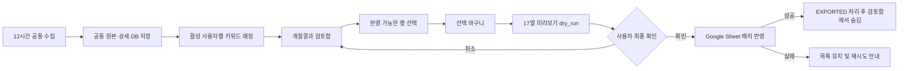

# 개찰결과 검토함 UX 명세

- 상태: 개인별 MVP 구현·로컬 및 Google Sheet smoke 검증 완료
- 대상: 데스크톱 내부 업무 플랫폼
- 범위: 사용자별 포함·제외 키워드, 개찰결과 검토, 개인 Google Sheet 연결, 선택 결과 미리보기·확정 반영
- 제외: 개인별 Google Drive/Sheets OAuth 권한 위임, Sheet 전체 편집기, 개찰결과 원본 수동 수정

## 1. 핵심 원칙

1. 12시간 수집은 DB까지만 갱신하며 Google Sheet를 호출하지 않는다.
2. 목록 조회·검색·체크박스 선택은 Google Sheet를 호출하지 않는다.
3. 사용자가 고른 `result_id`만 서버 `dry_run=true` 미리보기에 전달한다.
4. 사용자가 17개 열과 목적지를 확인한 뒤 최종 반영해야만 `dry_run=false`를 호출한다.
5. 성공한 개인 반영은 현재 사용자에게만 숨기고, 실패한 결과는 검토함에 남긴다.
6. 제외하거나 성공적으로 반영한 결과는 다음 수집에서 다시 노출하지 않는다.
7. 공고정보가 불완전하거나 업체 상세 수집이 끝나지 않은 행은 선택 단계부터 차단한다.
8. 개찰 원본과 업체 상세는 사용자 수와 관계없이 한 번만 저장하고, 활성 사용자의 키워드
   프로필로 사용자별 받은 목록만 분리한다.

## 2. 사용자와 권한

| 사용자 | 할 수 있는 일 | 할 수 없는 일 |
| --- | --- | --- |
| 인증 사용자 | 본인 포함·제외 키워드 편집, 본인에게 매칭된 결과 검토, 개인 Sheet 등록·검증·반영, 본인 목록에서 제외 | 다른 사용자의 프로필·결과·Sheet 목적지 조회·사용 |

MVP의 개인 연동은 개인별 Google Drive/Sheets OAuth 권한 위임이 아니라 공통 서비스계정에 각 사용자의 Sheet를
공유하고, `sheet_destinations.owner_user_id`로 목적지를 분리하는 방식이다. 조직·조직 공용
목적지 모델은 백엔드 호환을 위해 남아 있지만 현재 프론트 사용자 흐름에는 노출하지 않는다.

## 3. 사용자 흐름



체크박스 선택과 첫 번째 `반영 내용 확인`은 실제 Sheet 쓰기가 아니다. 미리보기 응답의
`preview_token`을 포함한 두 번째 `최종 반영`만 쓰기를 실행한다.

## 4. 화면 구조

### 4.1 개찰결과 검토함

```text
┌──────────────────────────────────────────────────────────────────────────────┐
│ 개찰결과 검토함                         최근 수집 07-19 00:17  [새로고침] │
│ 최근 14일 · 내 키워드 조건 · DB 조회이며 새로고침은 나라장터를 호출하지 않음│
├──────────────────────────────────────────────────────────────────────────────┤
│ [사업명·공고번호·기관·업체 검색] [상태 전체] [반영 가능 상태] [기간]      │
│ 매칭 키워드: AI  클라우드  연수                              [조건 보기] │
├──────────────────────────────────────────────────────────────────────────────┤
│ □ │ 개찰일 │ 공고번호 │ 사업명/수요기관 │ 결과 │ 매칭 │ 반영 상태 │ …  │
│ □ │ 07-18  │ R26...   │ AI 교육 운영    │ 낙찰 │ AI   │ 반영 가능 │ >  │
│ - │ 07-18  │ R26...   │ 클라우드 구축   │ 개찰 │ ...  │ 상세 대기 │ >  │
│ - │ 07-17  │ R26...   │ 연수 운영       │ 낙찰 │ ...  │ 공고 누락 │ >  │
├──────────────────────────────────────────────────────────────────────────────┤
│ 3건 선택 │ [선택 항목 보기] [전체 해제] │ 내 개찰결과 Sheet [반영 내용 확인]│
└──────────────────────────────────────────────────────────────────────────────┘
```

- 기본 목록은 현재 사용자에게 보이는 최근 14일의 미처리 결과다.
- 검색 대상은 공고번호, 사업명, 수요기관, 낙찰업체다.
- 상태 필터는 개찰완료, 낙찰확정, 유찰, 재입찰, 취소, 확인 필요를 사용한다.
- 반영 상태는 `반영 가능`, `상세 수집 대기`, `공고정보 누락`, `공고정보 중복`을 사용한다.
- 선택 불가능한 행은 체크박스를 비활성화하고 행 안에 차단 이유를 표시한다.
- 선택은 페이지·검색 필터를 이동해도 현재 브라우저 세션에서 최대 100건까지 유지한다.
- 수동 새로고침, 내 키워드 조건 변경, 반영 성공 시 선택을 비우고 이유를 안내한다.

### 4.2 결과 상세 Drawer

- 공식 사업명, 수요기관, 기초금액 또는 `비예가`, 제안마감, 지역제한, 2단계 입찰 여부
- 개찰상태, 개찰일, 참가업체 수, 매칭 키워드
- 상위 5개 업체의 순위·업체명·가격점수·기술점수·계산식
- 계산식은 `10+85.5=95.50` 형식을 사용하며 한 점수라도 없으면 빈 값으로 표시
- `내 목록에서 제외`는 원본 삭제가 아니며 다시 노출되지 않는다는 확인문을 표시
- 제외 직후 10초 동안 `실행취소`를 제공하며 사용자가 명시적으로 복원한 경우에만 다시 표시

### 4.3 선택 바구니

- 테이블 하단에 고정하고 선택 건수와 현재 목적지를 항상 표시한다.
- `선택 항목 보기`에서 페이지 밖에서 선택한 항목도 확인·해제할 수 있다.
- 목적지가 없으면 `반영 내용 확인` 대신 `내 Sheet 연결`을 주 CTA로 표시한다.
- `Sheet 목적지 삭제`는 결과 작업 영역에 두지 않고 연결 설정 안으로 이동한다.

### 4.4 Sheet 미리보기

```text
┌──────────────────────────────────────────────────────────────────────┐
│ Google Sheet 반영 내용 확인                                      X │
│ 목적지: 내 개찰결과 Sheet / 개찰결과 탭     선택 3건               │
├──────────────────────────────────────────────────────────────────────┤
│ 공고번호 │ 사업명 │ 발주처 │ 기초금액 │ ... │ 5위 │ 5위 총점     │
│ R26...   │ ...    │ ...    │ ...      │ ... │ ... │ 8+84=92.00  │
├──────────────────────────────────────────────────────────────────────┤
│ 기존 Sheet의 선택하지 않은 행은 변경하지 않음                       │
│                                      [취소] [최종 3건 반영]          │
└──────────────────────────────────────────────────────────────────────┘
```

- 서버가 생성한 A:Q 17개 열을 그대로 표시하며 프론트에서 값을 재계산하지 않는다.
- 미리보기 이후 결과 또는 목적지가 바뀌어 409가 발생하면 자동 재시도하지 않고 다시 확인시킨다.
- 성공 시 추가·갱신 건수, `Sheet 열기` 링크를 표시한다.
- 실패 시 선택을 유지하고 권한·탭·헤더·네트워크 오류를 구분해 안내한다.

### 4.5 내 Sheet 연결

```text
1. Google Sheet URL 또는 ID 입력
2. 탭 이름 입력(기본값: 개찰결과)
3. 설정 조회에서 미리 표시된 서비스계정 이메일을 해당 Sheet의 편집자로 공유
4. [연결 테스트]
5. 접근 가능·탭 존재·A:Q 헤더 상태 확인 후 [저장]
```

- 연결 테스트는 사용자가 누를 때만 Google API를 호출한다.
- 비어 있는 탭은 연결 가능으로 판단하고 첫 실제 반영 때 고정 헤더를 생성한다.
- 다른 헤더가 있는 탭은 덮어쓰지 않고 연결을 차단한다.
- 전체 URL을 입력해도 서버에 저장할 때는 정규화된 Spreadsheet ID만 저장한다.

### 4.6 내 키워드 조건

- 기본 검토 화면에서는 현재 사용자의 활성 여부와 포함·제외 키워드를 요약한다.
- 인증된 사용자는 역할과 관계없이 별도 Drawer에서 본인 조건만 편집한다.
- 포함 키워드는 OR, 제외 키워드는 우선 제외로 판정한다.
- 저장하면 외부 API를 호출하지 않고 DB에 있는 최근 14일 공통 원본을 현재 사용자에 대해서만
  동기 재매칭한 뒤 기존 선택을 비운다.
- 여러 사용자가 같은 결과에 매칭되어도 업체 상세는 공통 원본에 한 번만 저장하고 공유한다.
- 신규 사용자는 비활성·빈 키워드로 시작한다. 전환 당시의 기존 활성 사용자는 조직 프로필을
  본인 프로필로 한 번 복사하며, 이후 변경은 사용자별로 독립적이다.

## 5. 상태별 화면 규칙

| 상태 | 화면 동작 |
| --- | --- |
| 최초 로딩 | 표 대신 스켈레톤, 쓰기 CTA 비활성화 |
| 목록 조회 실패 | 빈 표로 위장하지 않고 오류 설명과 다시 시도 버튼 표시 |
| 매칭 결과 없음 | 내 조건 요약과 본인 키워드 조건 설정 CTA 표시 |
| 필터 결과 없음 | 필터 초기화 CTA 표시 |
| Sheet 목적지 없음 | 개인 Sheet 연결 온보딩 표시 |
| 상세 수집 대기 | 선택 비활성화, 다음 12시간 수집에서 보충됨을 표시 |
| 공고정보 누락·중복 | 선택 비활성화, 누락 필드 또는 중복 공고키 표시 |
| 미리보기 만료·변경 | 실제 반영하지 않고 새 미리보기 요구 |
| Google API 실패 | 선택·목록 유지, 원인과 재시도 제공 |
| 반영 성공 | 성공 건만 목록에서 제거, 추가·갱신 건수와 Sheet 링크 표시 |
| 결과 제외 | 즉시 목록에서 숨기고 10초 실행취소 제공, 자동 재수집으로는 복원하지 않음 |

## 6. 프론트가 사용할 API 계약

| 기능 | API | 필수 응답·동작 |
| --- | --- | --- |
| 검토 목록 | `GET /api/v1/results` | 필터, 공식 공고정보, `sheet_exportable`, `sheet_block_reasons` |
| 상세 | `GET /api/v1/results/{id}` | 공식 공고정보, 상위 순위, 가격·기술·합계 점수 |
| 설정 | `GET /api/v1/results/settings` | 본인 키워드 프로필·개인 목적지·서비스계정 이메일. 조직 정보는 백엔드 호환 필드로만 유지 |
| 키워드 저장 | `PUT /api/v1/results/settings/profile` | 본인 프로필만 변경, 외부 API 없이 최근 14일 DB 원본 동기 재매칭 |
| 연결 테스트 | `POST /api/v1/results/sheet-destinations/verify` | 정규화 ID, Sheet 제목, 탭·헤더 상태, 서비스계정 이메일 |
| 목적지 저장 | `POST /api/v1/results/sheet-destinations` | 현재 프론트는 현재 사용자 소유 `PERSONAL` 목적지만 저장 |
| 미리보기 | `POST /api/v1/results/export/sheet` | `dry_run=true`, 17개 열, 실제 행, `preview_token` |
| 최종 반영 | `POST /api/v1/results/export/sheet` | `dry_run=false`, 같은 선택·목적지·`expected_preview_token` |
| 제외 | `DELETE /api/v1/results/{id}` | 공통 원본이 아닌 현재 사용자 상태만 `DISMISSED` |
| 제외 취소 | `POST /api/v1/results/{id}/restore` | 현재 사용자의 `DISMISSED` 상태만 제거하고 `RESTORED`와 실제 `visible` 여부 반환 |

## 7. 구현 완료 조건

- [x] 체크·검색·새로고침만으로 Google Sheet가 변경되지 않는다.
- [x] 반영 불가능한 행은 선택할 수 있고 나중에 실패하는 방식이 아니라 처음부터 차단된다.
- [x] 페이지와 필터를 이동해도 최대 100개 선택이 바구니에 유지된다.
- [x] 미리보기는 서버가 만든 정확한 17개 열과 점수 계산식을 표시한다.
- [x] 최종 확인 전에는 실제 쓰기 요청이 발생하지 않는다.
- [x] 개인 목적지는 소유자만 조회·사용할 수 있다.
- [x] 성공한 개인 반영은 본인 목록에서만 사라지고 실패한 항목은 남는다.
- [x] 제외 직후 실행취소할 수 있고 실행취소하지 않은 결과는 재수집 후에도 나타나지 않는다.
- [x] 제외·성공 반영 결과는 재수집 후에도 다시 나타나지 않는다.
- [x] 모든 인증 사용자는 본인 포함·제외 키워드만 수정할 수 있다.
- [x] 키워드 저장은 외부 API 호출 없이 최근 14일 DB 원본을 사용자별로 즉시 재매칭한다.
- [x] 같은 결과의 원본과 업체 상세는 여러 사용자에게 중복 저장·수집하지 않는다.

## 8. 후속 범위

- 반영 완료·제외 이력 전체 화면은 핵심 선택 반영 흐름이 안정화된 뒤 P1로 추가한다.
- Google Drive 탐색·사용자 권한으로 쓰기가 필요해질 때만 OAuth를 별도 도입한다.
- 사용자 초대·조직 배정 UI는 실제 2인 파일럿 후 조직관리 모듈로 분리한다.
